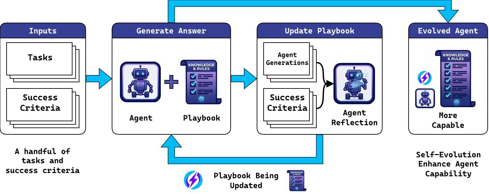

# LiteEvo


<p align="center">
  <a href="https://github.com/wbopan/liteevo"></a>
  <a href="https://github.com/wbopan/liteevo/blob/main/LICENSE"></a>
  <a href="https://github.com/wbopan/liteevo/stargazers"></a>
</p>

Use **Self-Evolution Finetuning** to supercharge your LLM with only 1 prompt!

## The Problem and What is LiteEvo?

- LLM Agents are powerful but sometimes still need explicit learning to solve unfamiliar problems. However, finetuning and prompt engineering are expensive and time-consuming. **Self-Evolution** is an easy and powerful way to let an LLM teach itself and evolve to be better at your tasks.

- **LiteEvo is an easy-to-use tool for self-evolution tuning of your models**. Instead of tuning model weights, it lets the model repeatedly attempt your task and **evolve a playbook (skill)** — a structured guidance document that captures successful strategies, common pitfalls, and learned heuristics.

- LiteEvo Self-Evolution only requires an **agent (Claude Code, Codex, or any LLM), 1–10 tasks, and <10 minutes** to finetune a playbook that boosts LLM agent performance!

- Over iterations, the playbook accumulates distilled knowledge that dramatically improves task performance — without changing a single model parameter.




## One-minute Quickstart with LiteEvo

**Prerequisites:**

- Python package manager `uv` to run the evolution.
- A working LLM agent. This can be any CLI agent (supporting `claude`, `codex`, and `gemini-cli`) or an OpenAI-compatible API.
- A specific task you want the LLM to be good at, with a criterion for what kind of output is expected.

```bash
# Install
git clone https://github.com/wbopan/liteevo.git && cd liteevo

# Evolve Claude Code
uv run evolve \
  --provider claude \
  --task "Generate a random number from 1-100" \
  --criterion "The number should be uniformly random" \
  --step-size 15 \
  --batch-size 5
```

Watch as the model discovers that it needs actual randomization strategies instead of picking "random-looking" numbers like 37 and 42!

## How It Works

### Core Concepts

**Playbook**: A structured JSON document containing guidelines, workflows, checklists, and examples. The model updates this document as it learns from successes and failures.

**Evolution Loop**: The iterative process of:
1. Generate response using current playbook
2. Accumulate results into batches
3. Reflect on batch performance against criteria
4. Update playbook with learned insights

**Criteria**: Success conditions that define what "good" looks like for each task. These drive the model's self-reflection.

### Hyperparameters

| Parameter | Description | Typical Value |
|-----------|-------------|---------------|
| `step-size` | Total number of generation iterations | 10-20 |
| `batch-size` | Steps between playbook updates | 3-5 |
| `playbook schema` | Structure defining the playbook format | See below |
| `update prompt` | Template for playbook update instructions | Customizable |

**Trade-offs**:
- Smaller batch → faster iteration, but risk of overfitting to individual examples
- Larger batch → more stable learning, but slower improvement cycles

## Playbook Schema

The playbook is a commented JSON structure:

```json
{
  "playbook_version": 0,
  "title": "Task Strategy Guide",
  "description": "Brief description of what this playbook helps with",
  "sections": {
    "guidelines": [
      "General tips and principles (max 10)"
    ],
    "workflow": [
      "Step-by-step process (max 10)"
    ],
    "checklist": [
      "Items to verify before completing (max 10)"
    ],
    "examples": [
      "Illustrative examples (max 10)"
    ]
  },
  "logs": [
    "v0: Initial. v1: Added randomization strategy",
    "v1: Found pattern. v2: Added edge case handling"
  ]
}
```

## Project Structure

```
liteevo/
├── prompts/
│   ├── UPDATE_PLAYBOOK.jinja2    # Playbook update template
│   ├── GENERATE_ANSWER.jinja2    # Generation template
│   └── PLAYBOOK_SCHEMA.txt       # Default playbook schema
├── src/liteevolve/
│   ├── __init__.py
│   ├── evolve.py                 # Core evolution loop
│   ├── provider.py               # LLM provider implementations
│   └── cli.py                    # Command-line interface
└── pyproject.toml
```

## CLI Reference

```bash
uv run evolve [OPTIONS]
```

### Required Options

| Option | Description |
|--------|-------------|
| `--provider` | LLM provider: `claude`, `codex`, `gemini`, `openai`, or `cli` |
| `--task` or `--tasks` | Single task string or glob pattern for task files |
| `--criterion` or `--criteria` | Single criterion string or glob pattern for criteria files |

### Optional Options

| Option | Default | Description |
|--------|---------|-------------|
| `--provider-args` | - | Provider-specific arguments |
| `--output-dir` | `outputs/YYYY-MM-DD-HHMMSS/` | Output directory |
| `--step-size` | 10 | Number of evolution steps |
| `--batch-size` | 3 | Steps per playbook update |
| `--prompt-update-playbook` | `prompts/UPDATE_PLAYBOOK.jinja2` | Update template path |
| `--prompt-generate-answer` | `prompts/GENERATE_ANSWER.jinja2` | Generation template path |
| `--schema-playbook` | `prompts/PLAYBOOK_SCHEMA.txt` | Playbook schema path |

## Provider Support

LiteEvolve supports multiple LLM providers out of the box:

### Claude (Anthropic)

Uses Claude Code CLI. No API key required if Claude Code is already configured.

```bash
uv run evolve --provider claude \
  --task "Your task here" \
  --criterion "Success criterion"
```

With custom arguments:
```bash
uv run evolve --provider claude \
  --provider-args "--model claude-sonnet-4-20250514" \
  --task "Your task" --criterion "Criterion"
```

### OpenAI / OpenAI-Compatible APIs

Supports OpenAI API and any compatible endpoint (Azure, local models, etc.).

```bash
# Using environment variable
export OPENAI_API_KEY="sk-..."
uv run evolve --provider openai \
  --provider-args "model=gpt-4" \
  --task "Your task" --criterion "Criterion"

# With explicit API key
uv run evolve --provider openai \
  --provider-args "model=gpt-4,api_key=sk-..." \
  --task "Your task" --criterion "Criterion"

# With custom endpoint (e.g., Azure, local)
uv run evolve --provider openai \
  --provider-args "model=gpt-4,base_url=https://your-endpoint.com/v1,api_key=..." \
  --task "Your task" --criterion "Criterion"

# With temperature control
uv run evolve --provider openai \
  --provider-args "model=gpt-4,temperature=0.5" \
  --task "Your task" --criterion "Criterion"
```

**OpenAI provider-args format**: `key1=value1,key2=value2,...`

| Key | Required | Description |
|-----|----------|-------------|
| `model` | Yes | Model name (e.g., `gpt-4`, `gpt-4o`) |
| `api_key` | No* | API key (*uses `OPENAI_API_KEY` env var if not set) |
| `base_url` | No | Custom API endpoint (default: OpenAI) |
| `temperature` | No | Sampling temperature (default: 0.7) |

### Gemini (Google)

Uses Gemini CLI.

```bash
uv run evolve --provider gemini \
  --task "Your task" --criterion "Criterion"
```

### Codex (OpenAI)

Uses Codex CLI (`codex exec`).

```bash
uv run evolve --provider codex \
  --task "Your task" --criterion "Criterion"
```

### Custom CLI

Use any CLI tool that accepts a prompt and returns output to stdout.

```bash
uv run evolve --provider cli \
  --provider-args "/path/to/your/llm-cli" \
  --task "Your task" --criterion "Criterion"
```

The custom CLI must:
- Accept a prompt as a command-line argument
- Return the response to stdout
- Return exit code 0 on success

## Usage Examples

### Single Task Evolution

Evolve a playbook for a single task with repeated iterations:

```bash
uv run evolve --provider claude \
  --task "Write a haiku about programming" \
  --criterion "Must follow 5-7-5 syllable structure strictly" \
  --step-size 15 --batch-size 3
```

### Multi-Task Evolution

Use glob patterns to load multiple tasks and criteria:

```bash
# Assuming examples/ascii_digit/tasks/001.txt, 002.txt, ... and matching criteria files
uv run evolve --provider openai \
  --provider-args "model=gpt-4" \
  --tasks "examples/ascii_digit/tasks/*.txt" \
  --criteria "examples/ascii_digit/criteria/*.txt" \
  --step-size 30 --batch-size 5
```

### Custom Templates

Use your own prompt templates:

```bash
uv run evolve --provider claude \
  --task "Solve math problems" \
  --criterion "Answer must be correct" \
  --prompt-update-playbook "./my-update-template.jinja2" \
  --prompt-generate-answer "./my-generate-template.jinja2" \
  --schema-playbook "./my-schema.txt"
```

### Output Structure

After evolution, the output directory contains:

```
outputs/2024-01-15-143022/
├── playbooks/
│   ├── playbook_v1.txt
│   ├── playbook_v2.txt
│   └── playbook_v3.txt      # Final evolved playbook
└── generations/
    ├── 000_task000_v0.txt   # Step 0, task 0, playbook v0
    ├── 001_task000_v0.txt
    ├── 002_task000_v0.txt
    ├── playbook_v1.txt      # Full update response for v1
    ├── 003_task000_v1.txt   # Now using playbook v1
    └── ...
```

## Template Variables

When customizing templates, the following variables are available:

| Variable | Type | Description |
|----------|------|-------------|
| `config` | EvolutionConfig | Contains `step_size`, `batch_size`, etc. |
| `step_id` | int | Current step (0-indexed) |
| `tasks` | list[str] | All task inputs |
| `generations` | list[str] | All generated outputs so far |
| `criteria` | list[str] | All success criteria |
| `playbooks` | list[str] | All playbook versions |
| `current_task` | str | Current task being processed |
| `current_criterion` | str | Current task's criterion |
| `current_playbook` | str | Latest playbook version |

## Notes

- Playbook extraction looks for the last ` ```json ` or ` ```jsonc ` code block in the update response
- Claude provider uses `claude -p "prompt"` to generate responses
- Task and criteria counts must match when using glob patterns
